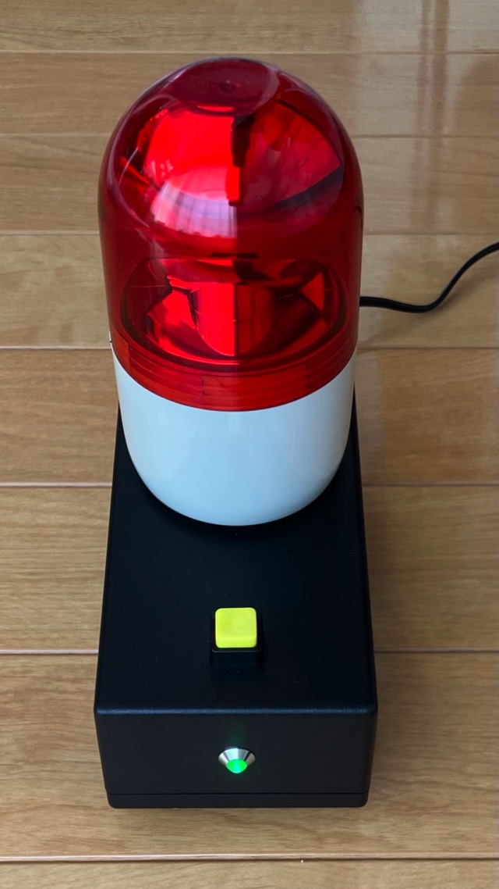
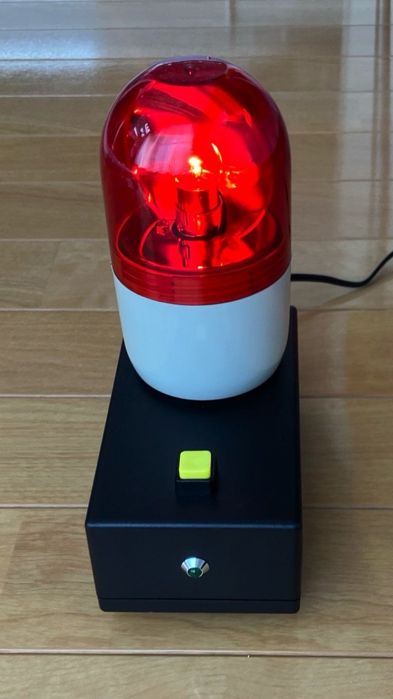

# TurnLightOn

日本語のREADMEは[こちら](./README_ja.md)

"TurnLightOn" is a "Rotary Beacon Light" device that turns on when instructed via voice commands to Amazon Alexa.

## Background & Purpose
My mother wears headphones while playing the piano and can't hear the surrounding sounds.  This has caused her problems, as she doesn't notice when called. To cope with these problems, I created the Alexa device with a "Rotary Beacon Light" to notify her visually.

## Device Description

- The following image depicts the device.
- A "Rotary Beacon Light" is attached to notify by a rotating red light.
- The green LED on the front indicates the Wi-Fi connection status.
- Pressing the yellow button turns off the Rotary Beacon Light.



## Execution Method
When the device is connected to power, the LED lights up and initiates the Wi-Fi connection.

When the LED goes off, the Wi-Fi connection is complete.  
 The device connects to Amazon Alexa service on the cloud.

When specific commands are given to Amazon Echo or the Alexa app, the Rotary Beacon Light is active.

The activated Rotary Beacon Light can be stopped by pressing the button.



## System Diagram
- The Alexa App, Amazon Echo, and the device are connected to the Wi-Fi router.
- Registering the device using the Alexa App. The device connects to the Alexa service on AWS (Amazon Web Services).
- Next, you register "Routines" in the Alexa App.
- When calling the "Routines" on the Amazon Echo, a notification is sent via the Wi-Fi router and AWS, and "Rotary Beacon Light" is activated.




## Setup Procedure

### 1 ArduinoIDE
- Installing Arduino IDE
- Setting up Raspberry Pi Pico W for use (details omitted).
- Registering PicoAlexa

  1. Open the PicoAlexa [GitHub repository](https://github.com/jksoft-main/Picoalexa) in your browser.
  2. Click on the CODE button and select 'Download ZIP' to download Picoalexa-main.zip.
  3. In the Arduino IDE, navigate to `Sketch > Include Library > Add .ZIP Library and select Picoalexa-main.zip`.

  
### 2 Software Modification

Launch Arduino IDE and modify the following lines in [TurnLightOn.ino](./TLO/TurnLightOn.ino)
 to fit your environment.

- Set the SSID and password of the Wi-Fi router you want to connect to.
  ```
  #define SSID      ""
  #define PASSWORD  ""
  ```
- If necessary, change the device name.
  ```
  #define DEVICE_NAME "TurnLightOn"
  ```

### 3　Compile and upload the software.
- Compile using the Arduino IDE.
- Once compiled, flash the software onto the Raspberry Pi Pico W.

### 4　Connecting to Wi-Fi
If the LED doesn't turn off, it might indicate a failure to connect to Wi-Fi. 
Please verify the SSID and Wi-Fi router password. Also, ensure that you are in an environment with enough signal strength.

### 5 Device Setup in the Alexa App
Install the Amazon Alexa app on your smartphone and register the device.
For example, if the device named `DEVICE_NAME` is recognized on the iPhone,  you're all set.  
`Add Device > Other > WiFi > Detect Devices`

Now, you can control the device's ON/OFF from the app.  
You can add a 'Routines' to this app when you control it using voice commands.
If the voice recognition isn't working, try to change the device name.

## Depending Software
This program uses the [PicoAlexa](https://github.com/jksoft-main/Picoalexa) library to run Raspberry Pi Pico W as an Amazon Alexa device.

## Hardware
I asked my father to design the hardware for the device. See [PicoLight](https://github.com/46nori/PicoLight) for details.

## License
The MIT License
