# TurnLightOn

TurnLightOnは、Amazon Alexaに音声で指示をしてパトライトを回す装置です。


## 背景・目的
母はヘッドホンを装着してピアノを弾いていると、周りの音が聞こえません。  
呼びかけに気づかないことでトラブルが発生することがありました。  
その解消のために、パトライトで視覚的に知らせるAlexaデバイスを作りました。  

## デバイスの説明

- 以下の写真がデバイスです。
- 回転する赤い光で知らせるようにパトライトがついています。
- 前面の緑のランプはWi-Fi接続状況を表すLEDです。
- 黄色ボタンを押すとパトライトは消灯します。


## 実行方法
デバイスを電源に接続するとLEDが点灯し、Wi-Fi接続を開始します。  
LEDが消えるとWi-Fi接続完了です。  
デバイスがクラウドを通してAmazon Alexaと繋がります。

ECHOまたはAlexa APPに対して特定の指示をするとパトライトが点灯します。

点灯しているパトライトはボタンを押すことで止めることができます。


## システム図
- Alexa App とAmazonECHO、デバイスはWi-Fiルータに接続されています。
- Alexa Appでデバイスを登録します。AWS(Amazon Web Services)上のAlexaサービスとデバイスが繋がります。
- 次に、Alexa Appで定型アクションを登録します。 
- AmazonECHOで定型アクションを呼び出すとWi-FiルーターとAWSを通してデバイスに通知され、パトライトが点灯します。




## セットアップ手順

### 1 ArduinoIDE
- AdruinoIDEのインストール
- Raspberry Pi Pico Wを使えるようにセットアップ(詳細は割愛します。)
- PicoAlexaの登録
  1. ブラウザで[PicoAlexaのGitHubリポジトリ](https://github.com/jksoft-main/Picoalexa)を開きます。
  2. CODEボタンでDownload ZIPを選択し、Picoalexa-main.zip をダウンロードします。
  3. ArduinoIDEの`スケッチ＞ライブラリをインクルード＞.ZIP形式のライブラリをインストール`で`Picoalexa-main.zip`を指定します。

  
### 2　ソフトウェアの修正

ArduinoIDEを起動し、[TurnLightOn.ino](./TLO/TurnLightOn.ino)の以下の行を環境に合わせて変更します。

- 接続するWiFiルータのSSIDとパスワードを設定します。
  ```
  #define SSID      ""
  #define PASSWORD  ""
  ```
- 必要に応じてデバイス名を変更します。
  ```
  #define DEVICE_NAME "TurnLightOn"
  ```

### 3　コンパイルとソフトの焼き込み
- ArduinoIDEを使ってコンパイルします。
- コンパイルができたら、Rassbery Pi Pico Wへソフトを焼き込みます。

### 4　Wi-Fiへの接続
LEDが消えない場合は、Wi-Fiに接続できないからかもしれません。  
SSIDとWi-Fiルーターのパスワードを確認してください。  
また、十分な強度の電波が受信できる環境かどうかも確認してください。

### 5 Alexaアプリでのデバイス設定
スマホのAmazon Alexaアプリで、デバイスを登録します。
例えばiPhoneでは、以下の手順で `DEVICE_NAME` で設定したデバイスが認識されればOKです。  
`デバイスを追加 ＞ その他 ＞ WiFi　＞ デバイスを検出`

これでアプリからデバイスのON/OFFができるようになります。
音声で操作したい場合は、このアプリ上で `定型アクション` を追加してみてください。  
音声認識にはやや癖があるので、認識されない場合はデバイス名を変更するなど、試行錯誤が必要になるかもしれません。


## 利用している他のソフトウェア
Raspberry Pi Pico WをAlexaデバイスとして使うためのライブラリ[PicoAlexa](https://github.com/jksoft-main/Picoalexa)を利用しています。

## ハードウェア
デバイスのハードウェアの設計は父に頼みました。詳細は[PicoLight](https://github.com/46nori/PicoLight)を参照してください。

## ライセンス
MITライセンス
